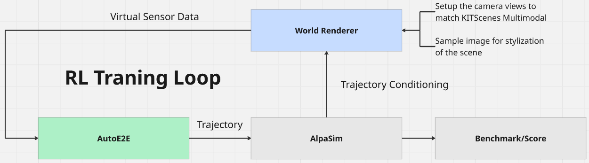

# Design Document: Closed-Loop Reinforcement Learning

## Document Metadata

| Field | Value |
|-------|-------|
| Status | Work in Progress / Proposed |
| Authors | Arseni10Lk |
| Date | 2026-08-06 |
| Related Issues | [#140](https://github.com/autowarefoundation/auto_e2e/issues/140), [#123](https://github.com/autowarefoundation/auto_e2e/issues/123) |

## 1. Executive Summary

This document outlines the architecture for the **Stage-3 Closed-Loop Reinforcement Learning** pipeline of the AutoE2E policy model. It details the integration of the policy with the **AlpaSim** microservices simulation engine, using the **KITScenes** dataset and **NuRec (3D Gaussian Splatting)** as the generative world renderer. To overcome computational bottlenecks during RL tuning, the architecture specifies a dual-backend **SimAdapter** (latent vs. pixel rollouts). Finally, it formally defines the **RewardRegistry**, proposing a non-redundant, faithfulness-gated reward function to penalize reward hacking, alongside a domain-specific evaluation suite featuring service manoeuvres and counterfactual synthesis.

## 2. Motivation and problem statement

### 2.1 Original goal

During the meeting on July 8th 2026, the basic closed-loop training logic was established: 



### 2.2 Architecture

The closed-loop reinforcement learning framework consists of three primary components that form a continuous feedback cycle:

1. **AutoE2E (Policy Model)**
   The core driving model consumes virtual sensor data and outputs a predicted trajectory. During RL training, this acts as the active agent policy exploring the environment.

2. **AlpaSim (Simulation Engine)**
   AlpaSim consumes the trajectory generated by AutoE2E to update the physics and state of the ego vehicle. It is responsible for two downstream tasks:
   - **Reward Generation**: It evaluates the safety and progress of the trajectory through a scoring module, which serves as the primary reward signal for policy optimization.
   - **Environment State**: It passes the updated kinematic state and trajectory conditioning to the rendering engine.

3. **World Renderer (Swappable)**
   The renderer synthesizes the next frame of the environment based on the updated vehicle state. It is dynamically configured to match the dataset's exact camera topology and utilizes stylistic conditioning to ensure visual consistency with the training distribution. The resulting virtual sensor data is then fed back into AutoE2E for the next time step, completing the loop.

## 3. Dataset Choice

The **KITScenes Multimodal** dataset is the primary foundation for closed-loop world generation and RL training.

**Justification:**
- **Sensor Fidelity**: Provides 72.5 MPix per frame across 9 global-shutter cameras (6×7.1 MPix surround, 1×16.2 MPix long-range, 2×7.1 MPix stereo pair) to support high-fidelity rendering.
- **Geographic Complexity**: Features irregular European road layouts (Karlsruhe, Frankfurt, Sindelfingen) to ensure robust policy training in non-grid environments.
- **RL Viability**: Designed explicitly for end-to-end driving and novel view synthesis, supplying the dense trajectory and visual data required to simulate realistic closed-loop consequences.


### 3.1 The USDZ Reconstruction Challenge

The primary challenge introduced by coupling KITScenes with AlpaSim is a fundamental mismatch in required data formats. 

**The Disconnect:**
* **KITScenes Format**: As detailed in the KITScenes repository [1] and on the Hugging Face dataset page [1], the dataset provides raw sensor streams (images, LiDAR) and standard Lanelet2 HD maps. It does **not** natively provide pre-compiled 3D scene representations (see KITScenes documentation [1] for a full breakdown of provided assets).
* **AlpaSim Requirement**: AlpaSim's default NuRec renderer strictly requires the environment to be packaged into a `.usdz` container representing the reconstructed 3D Gaussian Splatting scene, recorded first-frame JPEGs, and exact camera calibrations. As stated in AlpaSim's TUTORIAL.md [2], *"Scenes in AlpaSim are USDZ artifacts built from real-world driving logs. The default NuRec renderer relies on ClipGT data packaged in the USDZ..."* Furthermore, the simulation lifecycle relies on this file type, starting precisely from the first valid `.usdz` timestamp (OPERATIONS.md [2]).

**The Resolution:**
To bridge this gap, a prerequisite data pipeline step is necessary: a **KITScenes-to-NCore (USDZ) conversion**. We must run an offline 3D Gaussian Splatting reconstruction pipeline on the raw KITScenes data to compile the required `.usdz` artifacts, allowing the NuRec renderer to successfully boot and supply multi-view rendering for our RL loop.

## 4. World Renderer Choice

**NuRec (3D Gaussian Splatting)** combined with **CAT-K** (for reactive agent behavioral simulation) is the chosen world rendering pipeline.

**Justification based on [Issue #140](https://github.com/autowarefoundation/auto_e2e/issues/140) discussions:**
- **Synchronized Multi-View Generation**: 3DGS provides geometrically consistent and deterministic multiview rendering from a shared 3D representation, easily supporting KITScenes' complex 9-camera topology via explicit camera extrinsics/intrinsics.
- **Closed-Loop Latency**: Gaussian rasterization is highly performant and directly responds to ego trajectory changes, fulfilling the low-latency real-time requirements for RL training.
- **Handling Ghosting**: While 3DGS can exhibit ghosting artifacts when deviating far from the training path, this will be mitigated by terminating the RL session early (penalizing the agent) upon excessive path deviation.
- **Rejection of Alternatives**: Off-the-shelf diffusion models like NVIDIA Cosmos (OmniDreams) and Drive-WM were evaluated but ultimately rejected for the primary RL loop due to their prohibitive inference costs, lack of out-of-the-box synchronized multiview support, and difficulty in ensuring operational responsiveness to fine steering angles.

### 4.1 Why this is good news for our closed-loop training

AlpaSim supports NuRec out of the box. In fact, NuRec is designed as AlpaSim's **default** pluggable rendering backend, which eliminates the need for us to write custom boilerplate or bridging logic.

According to the official NVlabs/alpasim [2] documentation:
- **Native Integration**: The README.md [2] explicitly lists a "pluggable renderer service with default NuRec support" as a core feature.
- **Tutorial Default**: The Main Tutorial [2] states that standard execution uses the "NuRec-backed renderer" (`deploy=local`), validating its stability and readiness for immediate use.
- **Shared Endpoints**: Any alternative models (like OmniDreams) must adapt to the same `renderer` endpoint that NuRec natively owns (see VIDEO_MODEL.md [2]). 

Because of this, we can rely directly on AlpaSim's built-in hooks to stream our ego trajectories into NuRec and receive synchronized multiview observations with zero custom architectural overhead.

## 5. AutoE2E AlpaSim Plugin (WIP)

To bridge the policy model with the simulation engine, this architecture defines a native AlpaSim driver plugin located in `Model/plugins/alpasim_driver/`. *(Note: Full integration is currently Work in Progress, tracked in PR [#166](https://github.com/autowarefoundation/auto_e2e/pull/166) and [#177](https://github.com/autowarefoundation/auto_e2e/pull/177). The current implementation has several gaps that prevent the documented flow from working, so the following sections describe the intended target architecture).* This integration will connect AutoE2E directly to AlpaSim's microservices simulation loop without introducing custom networking overhead.

### 5.1 Architecture & Components

The plugin registers itself dynamically via Python entry points (`alpasim.models` and `alpasim.configs`), allowing it to be seamlessly invoked during an AlpaSim closed-loop rollout.

**Key Components:**
- **`AutoE2EDriver`**: The core implementation (subclassing AlpaSim's `BaseTrajectoryModel`). It consumes the simulator's `PredictionInput` and yields a `ModelPrediction` containing the generated trajectory and headings.
- **`AutoE2EAlpaSimConfig`**: A dataclass managing checkpoint paths and model initialization parameters (e.g., `allow_untrained_model`).
- **YAML Configuration**: Dynamic driver configs that formally register the 7-camera KIT topology with AlpaSim, overriding the default renderer camera setup to prevent `KeyError`s during closed-loop simulation.

### 5.2 Data Contract

The plugin establishes a input/output contract for the AutoE2E model:

**Input Observations (`PredictionInput`):**
- **Visual Topology**: While the KITScenes dataset provides 9 cameras for comprehensive rendering and reconstruction, the AutoE2E model actively consumes a **7-camera subset** (the 1 long-range and 6 surround cameras). These are explicitly defined as: `camera_base_front_center`, `camera_ring_front`, `camera_ring_front_left`, `camera_ring_front_right`, `camera_ring_rear`, `camera_ring_rear_left`, `camera_ring_rear_right`.
- **Telemetry**: Ego vehicle speed (*m/s*), acceleration (*m/s²*), yaw rate (*rad/s*), and trajectory curvature (*1/m*), alongside a `route_mask` natively rendered from the scene's dynamic `ego_pose`.

**Output Predictions (`ModelPrediction`):**
- **`trajectory_xy`**: Projected waypoint coordinates `[64, 2]` in the rig frame (*X* forward, *Y* left).
- **`headings`**: Target vehicle headings `[64]` in radians.

## 6. Reward Design (Future Work)

Based on the [Issue #123](https://github.com/autowarefoundation/auto_e2e/issues/123) proposal for stage-3 closed-loop RL, the reward function must address a core constraint: **a reward computed from information the policy already observes cannot change the policy's ranking of actions, it can only re-weight it.** Therefore, the shaping signal must carry information the policy does not otherwise have (e.g., predicted consequences, un-pooled spatial structure, or external ground truth).

### 6.1 The v1 Reward Formula

The baseline reward for the RL loop is defined as:

```python
R = w_safe * R_safety          # collision / off-road / TTC violation (hard, handcrafted)
  + w_prog * R_progress        # route progress (binding term to prevent stalling)
  + w_comf * R_comfort         # jerk, lateral acceleration
  + w_reason * g * R_reason    # reasoning-shaped, GATED (faithfulness gate)
  - λ * D(π || π_IL)           # imitation anchor (regularization)
```

*(Note: Keeping Imitation Learning as a regularization term inside RL is directly motivated by **RAD** [3]).*

### 6.2 The Faithfulness Gate (`g`)

A major risk in neural reward models is reward hacking, where the policy emits a reason that *matches* its action to farm rewards, even if that reason did not actually cause the action (a "plausible narrative", as warned in **LaViPlan** [4]).

To prevent this and enforce true reasoning-action consistency (**Alpamayo-R1** [5]), the `R_reason` term is multiplied by `g`, a **faithfulness gate**. `g` measures the causal coupling (via intervention delta). The reasoning-shaped reward contributes *only* when the reasoning is verifiably causal for the policy's trajectory. If `g` reads zero (as it does in early checkpoints), the term contributes nothing, falling back smoothly to the safety/progress baselines.

### 6.3 Progress as a Safety Metric

An imitation-only policy evaluated in AlpaSim demonstrated that safety/compliance terms alone score a stationary vehicle as near-perfect. Thus, `R_progress` is treated as a first-class safety metric; under-progress (e.g., driving 44 km/h slower than traffic) guarantees rear-end collisions.

## 7. Training Infrastructure (Future Work)

A photorealistic renderer in the closed RL loop is computationally expensive. To prevent the reward design and RL tuning phases from being bottlenecked by rendering latency, the proposed architecture introduces a dual-backend infrastructure.

### 7.1 Two-Tier Rollout Adapter (`SimAdapter`)

The `SimAdapter` will provide a unified interface for policy rollouts, abstracting away the underlying world model to support fast iteration:
- **Tier-L (Latent)**: Rollouts occur purely in the JEPA world-model latent space. Because there is no pixel rendering overhead, this tier is exceptionally fast and is used to sweep and tune reward variants across thousands of episodes. (Motivated by **MAPLE** [6], which proved the viability of latent-space multi-agent rollouts).
- **Tier-P (Pixel)**: Rollouts utilize the full generative simulator (AlpaSim + NuRec). This tier is reserved for final policy validation, generalization testing, and computing the definitive performance metrics.

### 7.2 The `RewardRegistry`

Following the established patterns for planners and temporal memory, reward terms will be implemented as decoupled plugins managed by a `RewardRegistry` (`handcrafted`, `irl`, `reasoning_shaped`, `faithfulness_gated`).

Each plugin conforms to a strict interface (`term(state, action, rollout, info) -> Tensor`) and must declare the inputs it consumes. This allows mechanical verification of the non-redundancy constraint outlined in Section 5.

## 8. Evaluation Strategy (Future Work)

To thoroughly validate the RL policy, our proposed evaluation suite addresses specific shortcomings found in existing public benchmarks (e.g., NavSim, Bench2Drive).

### 8.1 Service Manoeuvres Taxonomy

Standard closed-loop benchmarks predominantly evaluate merges, overtakes, and intersections. However, as a robotaxi application, the policy must also excel at passenger interactions. Our planned task taxonomy explicitly introduces **Service Manoeuvres**:
- **Pull-over**
- **Pick-up**
- **Drop-off**

These tasks will be evaluated using domain-specific service metrics, such as stopping precision (distance to curb) and door-opening safety.

### 8.2 Counterfactual Synthesis (Addressing Optimistic Bias)

A known risk of training world models exclusively on safe expert data is the development of an "optimistic bias" (**AD-R1** [7]). Because the model has never observed a collision, it cannot reliably predict the consequences of catastrophic actions. A reward computed *inside* this generative model can therefore get hacked by "hallucinated success" (**WoVR** [8]), leading the RL agent to optimize against a flawed simulation.

To combat this, the planned evaluation suite will rely on **Counterfactual Synthesis**. By generating a curriculum of plausible collisions and off-road events (diverging from the expert log), we will force the world model to predict unsafe states. Measuring how accurately the model represents these failure modes is a strict prerequisite before gating any rollout-based reward.

## 9. References

1. KIT-MRT. "KITScenes Multimodal Dataset." https://kitscenes.com/multimodal/
2. NVIDIA. "AlpaSim: Open-Source Generative Microservices for Autonomous Driving." https://github.com/NVlabs/alpasim
3. "RAD: Training an End-to-End Driving Policy via Large-Scale 3DGS-based Reinforcement Learning." 2025. https://arxiv.org/abs/2502.13144
4. "LaViPlan: Language-Guided Visual Path Planning with RLVR." 2025. https://arxiv.org/abs/2507.12911
5. "Alpamayo-R1: Bridging Reasoning and Action Prediction for Generalizable Autonomous Driving in the Long Tail." 2025. https://arxiv.org/abs/2511.00088
6. "Latent Multi-Agent Play for End-to-End Autonomous Driving." (MAPLE) 2026. https://arxiv.org/abs/2605.14201
7. "AD-R1: Closed-Loop Reinforcement Learning for End-to-End Autonomous Driving with Impartial World Models." 2026. https://arxiv.org/abs/2511.20325
8. "WoVR: World Models as Reliable Simulators for Post-Training VLA Policies with RL." 2026. https://arxiv.org/abs/2602.13977
