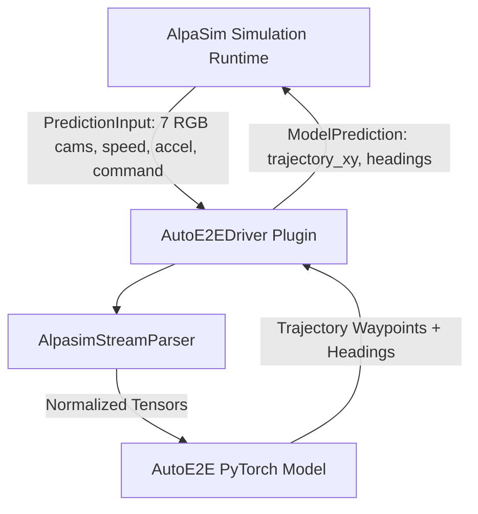

# AutoE2E AlpaSim Driver Plugin

This package provides the official **AutoE2E driver plugin** for [NVIDIA AlpaSim](https://github.com/NVlabs/alpasim), enabling real-time closed-loop evaluation and policy rollouts of the AutoE2E VLA driving model on the KitScenes 7-camera sensor topology.

---

## Architecture Overview

The plugin connects AutoE2E directly to AlpaSim's microservices simulation loop without custom networking overhead.



### Key Components

- **`AutoE2EDriver`** ([`plugin.py`](./plugin.py)): Subclass of AlpaSim's `BaseTrajectoryModel`. Implements `from_config()`, `camera_ids`, `context_length`, `output_frequency_hz`, and `predict()`.
- **`AutoE2EAlpaSimConfig`** ([`config.py`](./config.py)): Dataclass defining model checkpoint paths, 7-camera topology configuration, and trajectory horizon parameters.
- **Entry Points** ([`pyproject.toml`](./pyproject.toml)): Registers `autoe2e` under entry point groups `alpasim.models` and `alpasim.configs`.

---

## Data Contract & Sensor Topology

### Input Observations (`PredictionInput`)
- **Visual Topology**: 7 KitScenes camera streams (`camera_base_front_center`, `camera_ring_front`, `camera_ring_front_left`, `camera_ring_front_right`, `camera_ring_rear`, `camera_ring_rear_left`, `camera_ring_rear_right`).
- **Telemetry**: Scalar ego vehicle speed ($\text{m/s}$), acceleration ($\text{m/s}^2$), and high-level routing `DriveCommand` (LEFT, STRAIGHT, RIGHT).

### Output Predictions (`ModelPrediction`)
- **`trajectory_xy`**: Waypoint coordinates $[64, 2]$ in rig frame ($X$ forward, $Y$ left).
- **`headings`**: Vehicle target headings $[64]$ in radians.

---

## Installation & Setup

### 1. Install Driver & Dependencies

Install the driver plugin and dataset parser in editable mode:

```bash
# 1. Install alpasim_driver plugin package
pip install -e Model/plugins/alpasim_driver

# 2. Install KITScenes SDK
pip install -e Model/data_parsing/kit_scenes/kitscenes --no-deps

# 3. Install Lanelet2 (for vector HD map parsing & BEV rasterization)
pip install lanelet2
```

### 2. Environment Configuration

Configure root directories for KITScenes dataset files and AlpaSim source repository. You can source them from `.env` or export them manually:

```bash
# Option A: Load from .env file
set -a; source .env; set +a

# Option B: Set environment variables manually
export KITSCENES_ROOT="/path/to/auto_e2e/.KITdata"
export ALPASIM_ROOT="/path/to/auto_e2e/.alpasim"
```

### 3. Download KITScenes Data Samples

Download dataset scene archives using the `kitscenes` CLI:

```bash
python -m kitscenes.download "$KITSCENES_ROOT" --scenes c34c778f-ad8c-0aa9-7e1a-c86a73f887c7
```

---

## Model Control Parameters

Controls for simulation execution in [`config.py`](./config.py) and [`plugin.py`](./plugin.py):

| Parameter | Type | Default | Description |
| :--- | :--- | :--- | :--- |
| `checkpoint_path` | `str` | `"autoe2e_model.ckpt"` | Path to pre-trained AutoE2E PyTorch checkpoint file. |
| `allow_untrained_model` | `bool` | `False` | When `True`, initializes a fresh `AutoE2E(num_views=7)` PyTorch neural network with random weights if no checkpoint file exists on disk. |
| `allow_mock` | `bool` | `False` | When `False` (default), strictly requires the actual AlpaSim runtime and real model execution, failing fast if dependencies are missing. |

---

## Plugin Discovery Verification

Confirm that AlpaSim discovers the `autoe2e` plugin entry points:

```python
import alpasim_driver.plugin
import alpasim_plugins.plugins as p

print("Registered Models:", p.PluginRegistry("alpasim.models").get_names())
print("Registered Configs:", p.PluginRegistry("alpasim.configs").get_names())
```

**Expected Output**:
```text
Registered Models: ['autoe2e']
Registered Configs: ['autoe2e']
```

---

## Running Closed-Loop Workflows

### Workflow A: Closed-Loop Model Policy Rollouts (`run_closed_loop.py`)

Executes real-time closed-loop rollouts of the `AutoE2E` PyTorch neural network model taking 7 camera streams at 10 Hz:

```bash
python Model/plugins/alpasim_driver/examples/run_closed_loop.py
```

### Workflow B: World Renderer Verification (`verify_world_renderer.py`)

Drives closed-loop simulation using ground-truth trajectory predictions to evaluate and compare world renderers (AlpaSim vs NuRec vs KITScenes renderer) without policy prediction noise:

```bash
python Model/plugins/alpasim_driver/examples/verify_world_renderer.py
```

### Expected Output Example
```text
[INFO] Starting World Renderer Verification (Ground Truth Trajectory Driver)
[INFO] Discovered AlpaSim Registered Models: ['autoe2e']
[INFO] Discovered AlpaSim Registered Configs: ['autoe2e']
[INFO] Initialized Ground Truth Driver: GroundTruthTrajectoryDriver
[INFO] Subscribed Camera Topology (7 cameras): ['camera_base_front_center', 'camera_ring_front', 'camera_ring_front_left', 'camera_ring_front_right', 'camera_ring_rear', 'camera_ring_rear_left', 'camera_ring_rear_right']
[INFO] Evaluating World Renderer across 50 simulation steps...
[INFO] [Renderer Step 00/50] t= 0.0s | Ego Pos: (  0.48m,   0.00m) | Speed:  4.76 m/s | Prediction Step Time:  0.60 ms
[INFO] [Renderer Step 49/50] t= 4.9s | Ego Pos: (  6.80m,   0.00m) | Speed:  4.76 m/s | Prediction Step Time:  0.17 ms
[INFO] World Renderer Verification completed successfully!
[INFO] Final Ground-Truth Position: (6.80m, 0.00m)
[INFO] Saved visualization GIF: /path/to/verify_world_renderer.gif
```